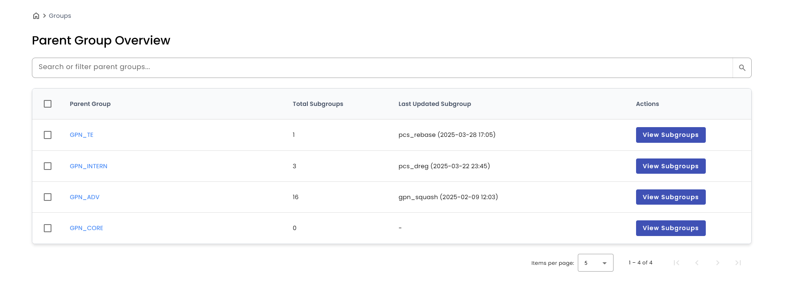
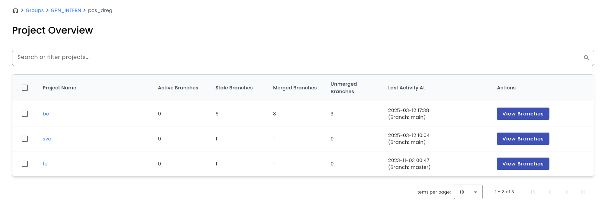
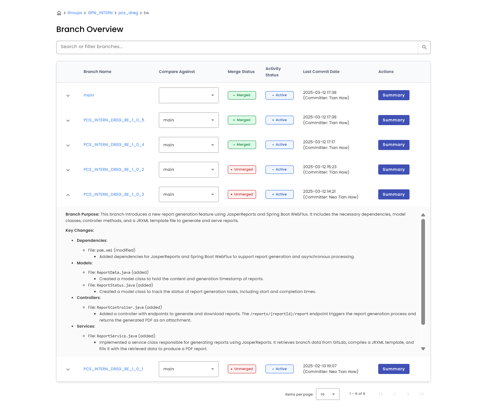
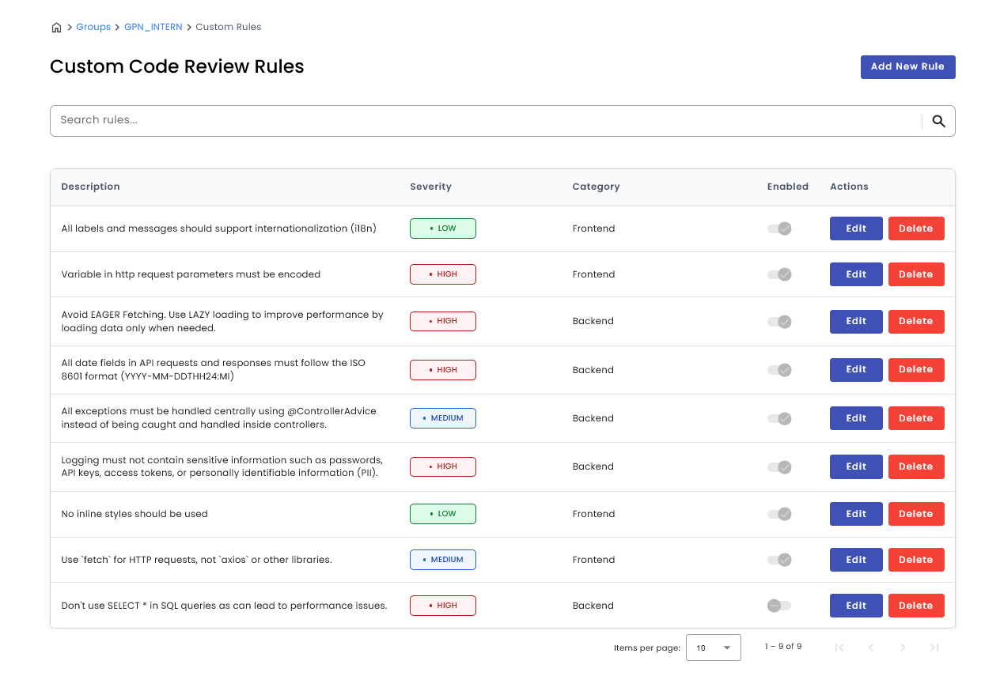
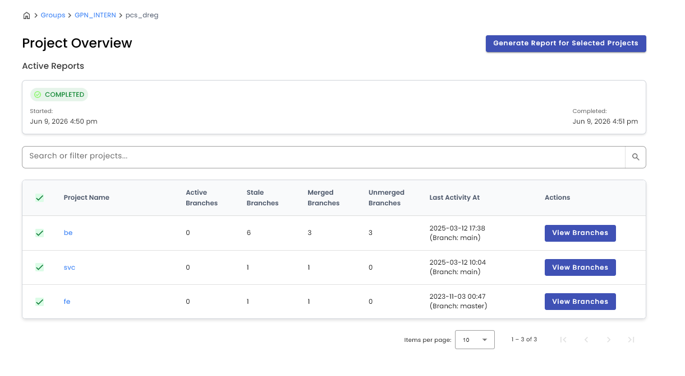
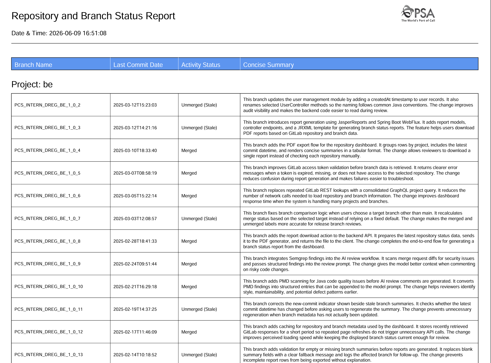
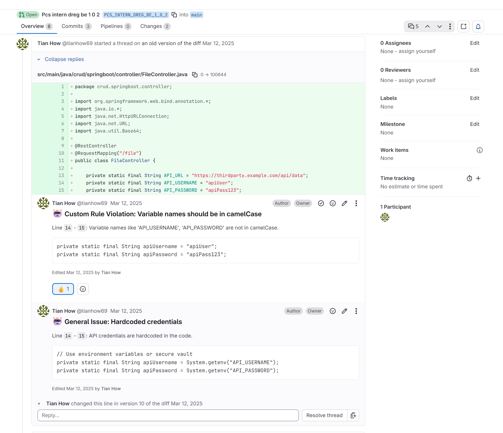
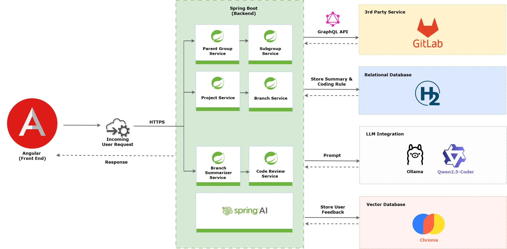
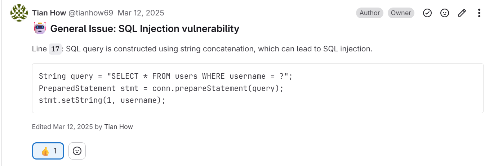
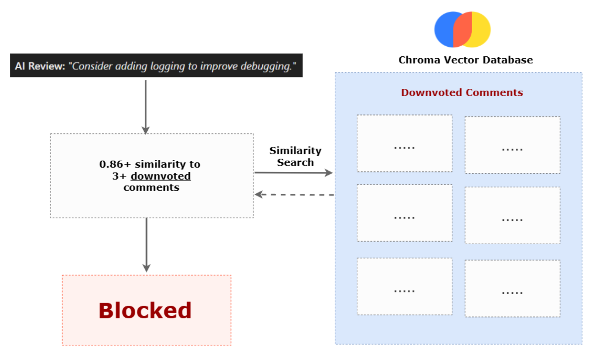

# Code Optics

AI-driven GitLab repository analytics and code review automation for enterprise teams managing many projects, branches, and merge requests.

## Overview

Code Optics is a full-stack dashboard that improves visibility and review efficiency across GitLab repositories. It was built for enterprise teams managing large GitLab workspaces, where manual branch tracking and code reviews can become slow, repetitive, and prone to missed changes across hundreds of repositories.

The system helps teams navigate GitLab parent groups, subgroups, projects, and branches from one interface. It tracks branch activity and merge status, generates AI summaries for branch changes, creates consolidated PDF reports for selected projects, and triggers AI-assisted merge request reviews through GitLab webhooks.

The AI features are designed for security-conscious environments by using Ollama with Qwen 2.5 Coder locally, so source code does not need to leave the internal network.

## Features

- Repository dashboard for GitLab parent groups, subgroups, projects, and branches.
- Branch health metrics, including active, stale, merged, and unmerged branch counts.
- Dynamic branch comparison against a selected target branch.
- AI-generated branch summaries that explain branch purpose and key code changes.
- Summary freshness tracking that marks branches when new commits make a stored summary outdated.
- Cross-repository PDF report generation for selected projects, focused on unmerged branches and concise branch summaries.
- Report status polling and persistent report file listing/downloads.
- AI-assisted merge request review through GitLab webhooks.
- Custom code review rules by parent group and project category, such as frontend, backend, and service rules.
- Diff preprocessing and chunking for large merge request reviews.
- Optional Chroma vector database service for feedback filtering.

## Screenshots

### Parent Group Overview



### Project Overview



### Branch Summary



### Custom Code Review Rules



### Report Generation Status



### Generated PDF Report



### AI Review on GitLab Merge Request



## Tech Stack

Frontend:

- Angular 20
- Angular Material
- RxJS
- Marked for rendering Markdown summaries

Backend:

- Java 17
- Spring Boot 3.3
- Spring WebFlux WebClient
- Spring AI with Ollama
- Qwen 2.5 Coder model
- Spring Data JPA
- H2 embedded database
- JasperReports for PDF generation

Tools and services:

- GitLab API and GitLab merge request webhooks
- Maven
- npm
- Docker Compose
- Chroma vector database, optional
- JaCoCo, JUnit, Mockito, Karma, Jasmine

## Architecture



The Angular frontend provides the dashboard, search, pagination, branch comparison controls, custom rule management, and report status UI. The Spring Boot backend retrieves GitLab data, enriches it with branch status metrics, stores branch summaries and custom rules in H2, calls Ollama for AI summaries/reviews, and generates PDF reports with JasperReports.

For merge request automation, GitLab sends webhook events to the backend. The backend verifies the webhook secret, fetches merge request diffs, applies custom rules, prompts Qwen 2.5 Coder, and posts review comments back to the merge request.

## Feedback Filtering with ChromaDB

Feedback filtering improves AI-assisted merge request reviews by learning from developer reactions. It adds a lightweight feedback loop that helps Code Optics avoid posting review comments similar to ones developers previously downvoted, while preserving comments that received positive feedback. The approach was inspired by the feedback-search pattern described in Tribe AI's [Lessons from 27 Months Building LLM Coding Agents](https://www.tribe.ai/applied-ai/lessons-from-27-months-building-llm-coding-agents).

In Code Optics, AI review comments can receive GitLab emoji feedback, such as thumbs up or thumbs down. A thumbs down indicates that reviewers found the comment unhelpful, and feedback filtering prevents similar unhelpful messages from repeatedly surfacing in future merge request reviews. `FeedbackFilterService` reads those reactions after a merge request is completed, extracts the AI review comment text, vectorizes that text with an embedding model, and stores it in the Chroma vector store with metadata such as feedback type, project ID, merge request IID, and timestamp.



When a new AI review comment is proposed, the same comment text is vectorized and searched against previously downvoted comments in ChromaDB. The vector search uses cosine similarity to find semantically similar feedback. A comment can be blocked when at least three downvoted comments are found above the 0.85 similarity threshold. This reduces repeated low-value review comments without needing to fine-tune the model.



The system uses Chroma as the vector database because it can run locally through Docker Compose and fits the project's internal-network deployment model. Chroma settings are documented in `application.properties`, and the Chroma container is available through `compose.yaml`.

## Getting Started

Requirements:

- Java 17 or newer
- Node.js 20.19 or newer
- npm
- Maven wrapper included in `be`
- Ollama with `qwen2.5-coder:7b-instruct`
- Docker, optional for Chroma

Prepare the local AI model:

```bash
ollama pull qwen2.5-coder:7b-instruct
ollama serve
```

Clone the repository and install the frontend dependencies:

```bash
cd fe
npm install
```

Configure backend environment variables:

```bash
GITLAB_API_URL=https://gitlab.com/api/v4
GITLAB_API_PRIVATE_TOKEN=your_gitlab_token
GITLAB_WEBHOOK_SECRET=your_webhook_secret
APP_REPORT_STORAGE_LOCATION=./reports
SPRING_DATASOURCE_PASSWORD=
```

Start the backend:

```bash
cd be
./mvnw spring-boot:run
```

On Windows PowerShell:

```powershell
cd be
.\mvnw.cmd spring-boot:run
```

Start the frontend:

```bash
cd fe
npm start
```

The frontend runs on `http://localhost:4200` and calls the backend at `http://localhost:8080` by default.

Optional Chroma service:

```bash
docker compose up -d
```

## Usage

1. Open the dashboard and start from the parent group overview.
2. Drill down into subgroups, then projects, then branches.
3. Use search and pagination to find the relevant repository or branch.
4. Review project-level branch counts to identify stale or unmerged work.
5. In the branch view, compare a branch against another target branch.
6. Generate or refresh an AI summary when the warning indicator shows that a branch summary is missing or outdated.
7. Select projects from the project overview and generate a consolidated PDF report.
8. Manage custom code review rules from the custom rules page.
9. Configure GitLab merge request webhooks to call `/api/webhooks/gitlab` so new or updated merge requests receive AI-assisted review comments.

## API Highlights

- `GET /api/groups` - list parent groups.
- `GET /api/groups/{groupId}/subgroups` - list subgroups.
- `GET /api/groups/subgroups/{subgroupId}/projects` - list projects with branch metrics.
- `GET /api/projects/{id}/branches` - list branches with activity, merge status, and summary metadata.
- `GET /api/projects/{projectId}/branches/compare` - compare source and target branches.
- `GET /api/projects/{projectId}/branches/compare/summary` - generate a branch summary.
- `POST /api/projects/report` - start asynchronous PDF report generation.
- `GET /api/projects/report/{reportId}/status` - poll report generation status.
- `GET /api/reports/files` - list generated reports.
- `GET /api/reports/files/{filename}` - download a generated report.
- `GET /api/custom-rules` - list custom review rules.
- `POST /api/custom-rules` - create a custom review rule.
- `PUT /api/custom-rules/{id}` - update a custom review rule.
- `DELETE /api/custom-rules/{id}` - delete a custom review rule.
- `POST /api/webhooks/gitlab` - receive GitLab merge request webhook events.

## Results

The capstone evaluation reported the following outcomes:

- AI-assisted code review detected about 86.6% of injected OWASP Top 10 security vulnerabilities.
- Service-layer unit test coverage reached about 90% line coverage and 85% branch coverage.
- 46 user acceptance test cases were executed with real GitLab data in a deployed test environment.
- Developer feedback found the branch summaries clear and useful, with most participants reporting time savings.
- API optimization reduced dashboard response times to under 3 seconds during concurrent-user load testing.
- Feedback filtering improved review signal quality by increasing high-value comments from 30% to 80%.

## Testing

Run backend tests:

```bash
cd be
./mvnw test
```

Run frontend tests and build:

```bash
cd fe
npm run test:ci
npm run build
```

Optional dependency audit:

```bash
cd fe
npm audit --omit=dev
```

## Project Structure

```text
capstone_project/
  be/       Spring Boot backend, GitLab integration, AI services, reports
  fe/       Angular frontend dashboard
  data/     Local H2 database files
  reports/  Generated PDF reports
```

## Security Notes

- Do not commit real GitLab tokens, webhook secrets, H2 passwords, reports, or local database files.
- The backend reads sensitive values from environment variables.
- The intended deployment model keeps GitLab data and AI processing inside the internal network.
- Generated reports may contain repository metadata and branch summaries, so treat them as internal artifacts.
